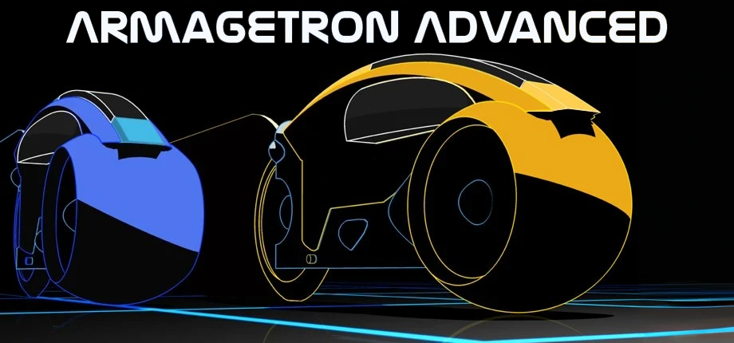
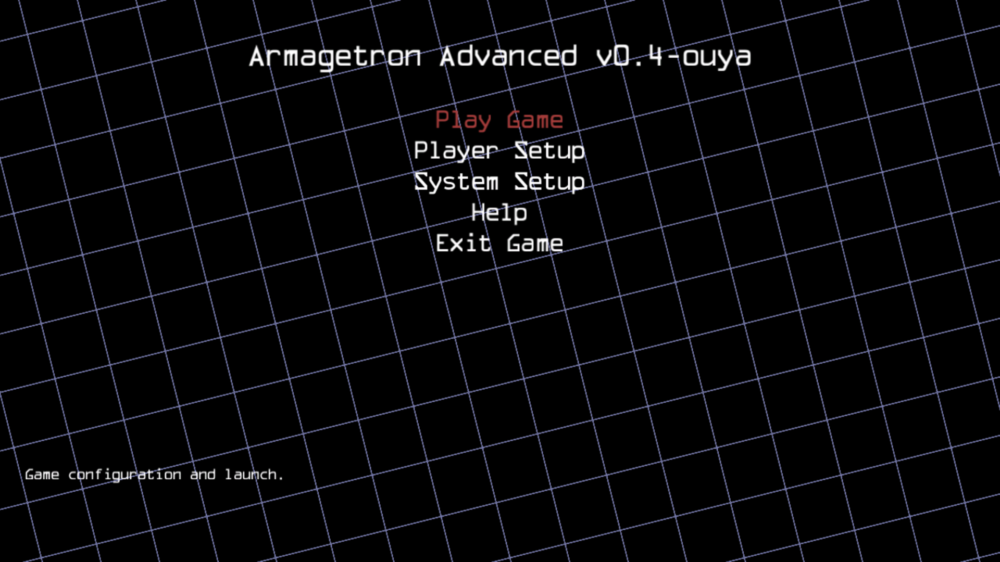
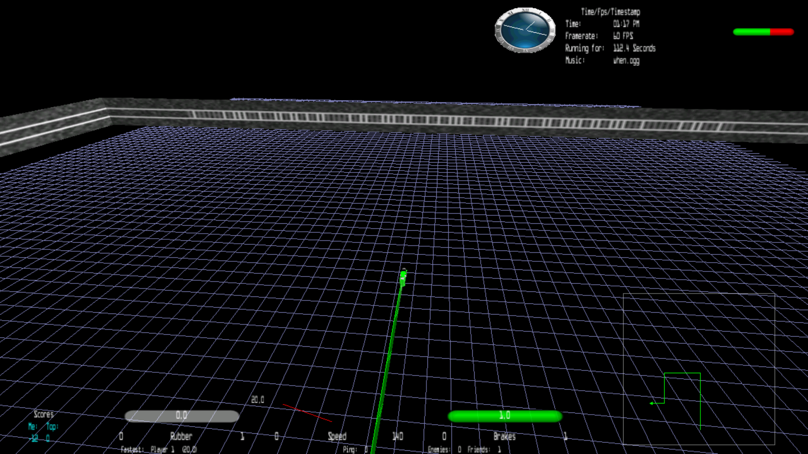

<p align="center">
  
</p>

# Armagetron Advanced — OUYA port

A native port of [**Armagetron Advanced**](https://www.armagetronad.org/) — the open‑source 3D
Tron light‑cycle game — to the **OUYA** microconsole. Runs fullscreen at a smooth frame rate on
the OUYA's NVIDIA Tegra 3 (Android 4.1 / API 16), driven entirely by the OUYA gamepad.

> Status: **playable** — boots, runs fullscreen, gamepad‑controlled, online‑capable.
> See [`docs/OUYA_PORT.md`](docs/OUYA_PORT.md) for the full technical write‑up of the port.

<p align="center">
  
  
</p>

## Features

- **Native OpenGL ES 2.0** rendering through [gl4es](https://github.com/ptitSeb/gl4es) — the
  desktop immediate‑mode GL of the engine is translated to GLES2 at a single backend point.
- **Fullscreen** output at a fixed 720p render buffer, upscaled by the OS to fill the panel —
  true fullscreen *and* fill‑rate headroom for a steady frame rate on Tegra 3.
- **Gamepad‑only controls** designed for the OUYA controller (no keyboard/mouse needed).
- **Self‑contained**: all game data (config, textures, models, sounds, music, language) is
  bundled in the APK and unpacked on first launch.
- **Online multiplayer** works (server browser + master server lookup over HTTPS).
- Appears in the **OUYA games menu** with a proper tile icon.

## Controls (OUYA controller)

| Input | Action |
|-------|--------|
| **D‑pad Left / Right** | Steer the light‑cycle |
| **D‑pad Down** | Brake |
| **OUYA system button** (single press) | Open / close the in‑game menu |
| **X / U** (left face button) | Switch camera mode |
| **D‑pad + face buttons** | Navigate menus (O = Select / A = Back) |

On a non‑OUYA controller (e.g. a wired Xbox 360 pad) the **Start** button opens the in‑game
menu instead of the system button.

The analog stick is intentionally **unbound** — steering is digital (d‑pad) only, which also
prevents the OUYA's accelerometer from drifting the cycle. See the technical doc for why.

## Install (sideload on a real OUYA)

1. Download the APK from the [Releases](../../releases) page.
2. Copy it to the OUYA and install it (e.g. via [`adb`](https://developer.android.com/tools/adb)):
   ```sh
   adb connect <ouya-ip>:5555
   adb install -r ArmagetronAdvanced-OUYA.apk
   ```
3. The game appears in **Make → … / Games**. The **first launch only** shows an
   "Installing game data…" screen with a progress percentage while the bundled game data is
   unpacked to storage (~30–60 s on the OUYA's slow flash) — this is normal and happens once
   per version.

## Which Armagetron version is this?

The engine base of this port is the upstream **0.4 development trunk** — the in‑progress next
major version, which is *ahead of* the 0.2.9.x stable line (0.2.9.3.0 at the time of writing).
The 0.4 trunk is what provides the tutorials, the cockpit HUD system and other features this
port uses. Port releases are numbered **rN** (`0.4-trunk-ouya-rN`) independently of engine
versions; earlier releases were tagged `0.4.x`, which unintentionally looked like an engine
version number — they were port release numbers.

## Build from source

Requires the **Android NDK r23.2.8568313**, **JDK 11**, and the prebuilt native dependencies
(included under `android/app/src/main/cpp/lib`) plus **Boost 1.82 headers** (not vendored — see
[`docs/OUYA_PORT.md`](docs/OUYA_PORT.md#dependencies)).

> ⚠️ On Windows, build from a path **without spaces** (AGP/ninja break on them). Use a junction:
> `New-Item -ItemType Junction -Path C:\arma -Target "<repo>"`, then build from `C:\arma`.

```sh
cd android
./gradlew assembleDebug
# -> app/build/outputs/apk/debug/app-debug.apk
```

Target: `armeabi-v7a`, `minSdkVersion 16`, OpenGL ES 2.0.

## Credits & license

- **Armagetron Advanced** © the Armagetron Advanced Team — **GPL‑2.0‑or‑later**.
  This port keeps the engine under the same license; see [`LICENSE`](LICENSE).
- Engine source lives under [`armagetronad/`](armagetronad/); the OUYA shell, native glue,
  CMake build and patches live under [`android/`](android/).
- Native GL translation by **gl4es** (ptitSeb); windowing/input via **SDL2**.

This is an unofficial, community port for a discontinued console, provided for preservation and
fun. Not affiliated with or endorsed by the Armagetron Advanced Team or OUYA.
